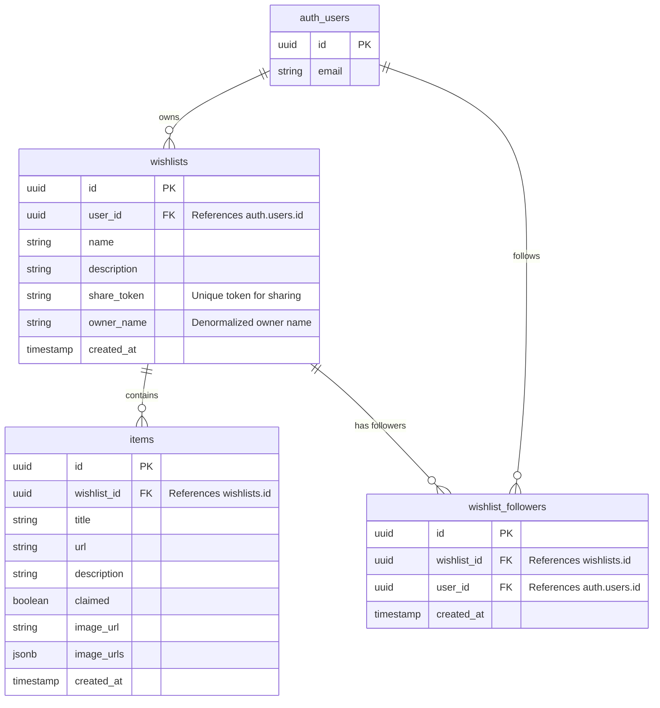

# Data Model

## Schema: `public`

### Entity Relationship Diagram

### Tables

#### `wishlists`
Stores user wishlists.
- **`owner_name`**: Added to support search by owner without complex joins. Populated on creation.
- **`share_token`**: Used for public sharing links.

#### `items`
Items saved to a wishlist.
- **`image_urls`**: Array of potential images for selection.
- **`image_url`**: The currently selected image.

#### `wishlist_followers`
Join table for users following wishlists.
- **`user_id`**: The follower.
- **`wishlist_id`**: The followed wishlist.
